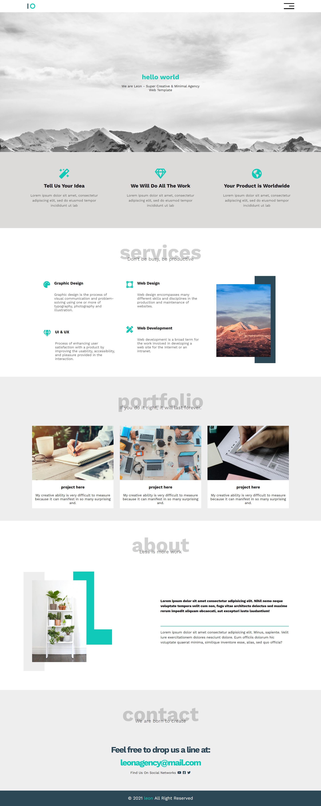

# leon
this is an HTML + CSS project that I worked on its code from scratch.

I intend to add JS to this page soon.

## Table of contents

- [Overview](#overview)
  - [Screenshot](#screenshot)
  - [Links](#links)
- [Built with](#built-with)
- [Author](#author)

## Overview

### Screenshot

### Links

- Solution URL: [Github repo](https://github.com/mohamedkhaled4053/leon)
- Live Site URL: [Github page](https://mohamedkhaled4053.github.io/leon/)

## Built with

- Semantic HTML5 markup
- CSS custom properties
- Flexbox
- Mobile-first workflow

## Author

- linkedin - [mohamed khaled](https://www.linkedin.com/in/mohamed-khaled-58602722b/)
- Github - [mohamed khaled](https://github.com/mohamedkhaled4053)
- Upwork - [Mohamed khaled](https://www.upwork.com/freelancers/~01a5a737ea63245d57)